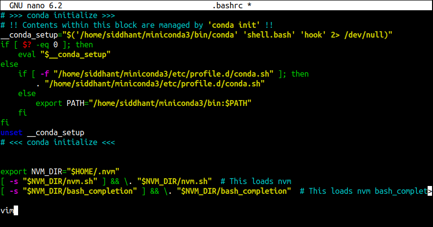
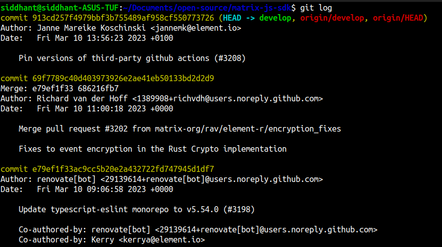

# OSDC WAIT WTF - WriteUp

 Even though its not necessary, we should replace the wtf command with the default sudo command before starting. This can be done simply by renaming the wtf file as everything in linux is a file!
```
$ which wtf       #this gives us the location of the wtf file
#/usr/bin/wtf

$ cd /usr/bin/
$ wtf mv wtf sudo
```
Now the sudo command works as intended.

## Challenge 1: The terminal always opens in Vim

The `.bashrc` file is a script file that’s executed when a user logs in. The file itself contains a series of configurations for the terminal session. This includes setting up or enabling: coloring, completion, shell history, command aliases, and more.

We can use the `cat` command to see its contents.

```
$ cat .bashrc
```
At the end of the file you'll find the `vim` command, indicating that vim will run on startup. This is causing the given problem.



We need to remove this and our problem is fixed.
```
$ nano .bashrc # to edit the file
# go to end of file and remove vim
```
 Vim no longer opens when opening a new terminal window.

## Challenge 2: I can't access the internet?

For this challenge, we need to look into all out network interfaces and set them up or down. We can do this using `ifconfig` or `ip` commands.
```
$ sudo apt install net-tools    # installs ip and other tools
$ ip address    # to view network interfaces
```


in the above example the interface enp0s3 is currently down

```
$ sudo ifconfig enp0s3 up
```
this changes the interface state to up and we should now be connected to the internet.

## Challenge 3: Shut it, Firefox.

A new Firefox session keeps opening every minute. This is implmented using `crontab`. It uses the job scheduler cron to execute tasks according to a set schedule.

```
$ crontab -u username -l    # to view active crontabs
$ crontab -u username -e
```
this opens a personal crontab configuration of your computer, which can be edited by using your default text editor. Edit this using `nano` and remove the firefox crontab at the end of the file.

## Challenge 4: End-Sem Project

To clone the given use the first install git using `sudo apt install git` and clone the given repo
```
$ git clone https://github.com/exitflynn/cool-repo.git
$ cd cool-repo
$ ls
# binS.c  hiworld.emojic
```
To compile `binS.c` we need to install the `gcc` compiler. This can by done by
```
$ sudo apt install build-essential
$ gcc binS.c -o output  # complies the file and outputs to output file
```

For `hiworld.emojic` we neet to install emojicode compiler
```
$ sudo apt install wget # this installs wget which can download files
$ wget https://github.com/emojicode/emojicode/releases/download/v1.0-beta.2/Emojicode-1.0-beta.2-Linux-x86_64.tar.gz -O emojicode.tar.gz \
&& tar -xzf emojicode.tar.gz && rm emojicode.tar.gz \
&& cd Emojicode-1.0-beta.2-Linux-x86_64 && ./install.sh \
&& cd .. && rm -r Emojicode-1.0-beta.2-Linux-x86_64
```

To compile our code run `emojicodec hiworld.emojic`. This results in an error. Use `nano hiworld.emojic`. Every string in Emojicode need to be wrapped with 🔤. So the edited code will look like


To compile
```
$ emojicodec hiworld.emojic
$ ./hiworld
# Hey!
```

## Challenge 5: Giddy-Up

For this challenge, we need to hard reset out github repo to recover the lost files using the `.git` folder. First cd into the folder where .git folder is located. All files starting with . are hidden in linux. To view them use the `ls -a` command. Next use `git log` to view all previous commit logs. This results in someting like



We need to reset to HEAD to recover all the files. This can be done using `git reset --hard HEAD` and then `git commit`.